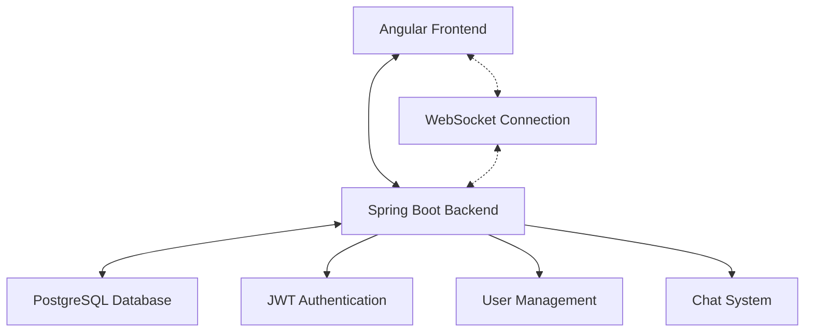

# 💬 WhatsApp Clone

A modern, real-time chat application built with Angular and Spring Boot, featuring WebSocket-based messaging, JWT authentication, and a responsive user interface.


## 🚀 Features

### ✅ Implemented
- **🔐 User Authentication**: Complete signup/signin flow with JWT tokens
- **💬 Real-time Chat**: WebSocket-based instant messaging between users
- **👥 User Management**: View available users and start conversations
- **📱 Modern UI**: Responsive design with sidebar navigation
- **🔔 Unread Messages**: Visual indicators for new messages with counters
- **💾 Chat History**: Frontend conversation persistence during session
- **🛡️ Security**: Password hashing with BCrypt, JWT token validation

### 🎯 Future Enhancements
- Message persistence in database
- File and image sharing
- Group chat functionality
- Push notifications
- User presence indicators
- Message read receipts
- Mobile app version

## 🏗️ Architecture



### Tech Stack

**Frontend**
- Angular 17.3.0 + TypeScript
- RxJS for reactive programming
- Angular Router for navigation
- ngx-cookie-service for session management

**Backend**
- Spring Boot 3.4.3 + Java 21
- Spring WebSocket for real-time communication
- Spring Security + JWT for authentication
- Spring Data JPA for database operations
- BCrypt for password hashing

**Database & DevOps**
- PostgreSQL 16
- Docker Compose for development
- Gradle build system

## 🛠️ Setup Instructions

### Prerequisites
- **Java 21** or higher
- **Node.js 18** or higher
- **Docker & Docker Compose**
- **Git**

### 1. Clone the Repository
```bash
git clone <repository-url>
cd WhatsApp
```

### 2. Database Setup
```bash
# Start PostgreSQL with Docker
docker-compose up -d

# This creates a PostgreSQL instance on localhost:5432
# Database: whatsapp_db
# User: postgres
# Password: password
```

### 3. Backend Setup
```bash
cd Backend/WhatsAppBackend

# Build and run the Spring Boot application
./gradlew bootRun

# Backend will be available at http://localhost:8080
```

### 4. Frontend Setup
```bash
cd Frontend/WhatsAppFrontend

# Install dependencies
npm install

# Start development server
ng serve

# Frontend will be available at http://localhost:4200
```

## 📖 Usage

1. **Register**: Create a new account at `http://localhost:4200/cadastro`
2. **Login**: Sign in with your credentials at `http://localhost:4200/login`
3. **Chat**: Select users from the sidebar to start conversations
4. **Real-time**: Messages appear instantly for all connected users

## 🔧 API Endpoints

### Authentication
- `POST /auth/signup` - User registration
- `POST /auth/signin` - User login

### Users
- `GET /users` - List all users (authenticated)

### WebSocket
- `WS /ws?username={username}` - WebSocket connection for real-time chat

## 📁 Project Structure

```
WhatsApp/
├── Backend/WhatsAppBackend/          # Spring Boot application
│   ├── src/main/java/com/mateus/WhatsAppBackend/
│   │   ├── auth/                     # Authentication module
│   │   │   ├── controller/           # REST controllers
│   │   │   ├── dto/                  # Data transfer objects
│   │   │   ├── model/                # Entity models
│   │   │   ├── security/             # Security configuration
│   │   │   └── service/              # Business logic
│   │   ├── user/                     # User management
│   │   └── websocket/                # WebSocket configuration
│   └── src/main/resources/           # Configuration files
├── Frontend/WhatsAppFrontend/        # Angular application
│   └── src/app/
│       ├── auth.service.ts           # Authentication service
│       ├── cadastro/                 # Registration component
│       ├── chat/                     # Chat component
│       ├── login/                    # Login component
│       └── app.routes.ts             # Routing configuration
└── docker-compose.yml               # Database container
```

## 🔒 Security

- JWT tokens with 1-hour expiration
- Password hashing using BCrypt
- CORS configuration for frontend-backend communication
- Protected API endpoints requiring authentication

## 🐛 Known Issues

- Messages are only persisted in frontend memory during session
- WebSocket authentication is simplified for development
- No message delivery confirmation yet

## 🔮 Next Steps

### 🎯 Features & Technical Improvements
- **📦 Message Persistence**: Implement complete database storage for chat history
- **👥 Group Chat**: Multi-user rooms and group conversation system
- **📎 File Sharing**: Upload and share images, documents, and media files
- **✅ Message Status**: Delivery confirmations, read receipts, and typing indicators
- **🔔 Push Notifications**: Real-time notifications via service workers
- **📱 PWA**: Progressive Web App for enhanced mobile experience
- **🎨 Themes**: Customizable light/dark theme system
- **🔍 Search**: Advanced search functionality for messages and contacts
- **📊 Analytics**: User engagement and usage metrics dashboard

### ☁️ Infrastructure & Cloud
- **🚀 Automated Deployment**: AWS/GCP/Azure deployment configurations
- **🐳 Full Containerization**: Production-optimized Docker containers
- **⚖️ Load Balancing**: NGINX reverse proxy and load distribution
- **📈 Auto Scaling**: Kubernetes horizontal pod autoscaling
- **💾 Redis Caching**: Message and session caching layer
- **🗄️ CDN**: Content Delivery Network for static assets
- **🔐 Secrets Management**: Vault or AWS Secrets Manager integration

### 🔄 CI/CD & DevOps
- **⚡ GitHub Actions**: Complete build, test, and deployment pipeline
- **🧪 Automated Testing**: Unit, integration, and E2E test suites
- **📊 Code Quality**: SonarQube analysis and quality gates
- **🔒 Security Scanning**: Dependabot and vulnerability assessments
- **🌍 Multi-Environment**: Staging, production, and feature branch deployments
- **📋 Code Review**: Automated PR checks and approval workflows

### 📊 Observability & Monitoring
- **📈 APM**: Application Performance Monitoring (New Relic/Datadog)
- **📝 Centralized Logging**: ELK Stack or Splunk integration
- **⚠️ Alerting**: Metrics-based alert system and notifications
- **📊 Dashboards**: Grafana visualization and monitoring dashboards
- **🔍 Distributed Tracing**: Jaeger or Zipkin request tracing
- **💡 Health Checks**: Application health monitoring endpoints
- **📋 Error Tracking**: Sentry integration for error monitoring

### 📊 Data & Analytics
- **🏢 Data Warehouse**: BigQuery or Snowflake for analytics storage
- **📊 ETL Pipeline**: Apache Airflow for data processing workflows
- **🤖 ML/AI**: Sentiment analysis and intelligent message suggestions
- **📈 Business Metrics**: User engagement and retention KPIs
- **🔍 Data Lake**: Unstructured data storage and processing
- **📊 Real-time Analytics**: Kafka/Kinesis stream processing
- **🎯 Recommendations**: Smart contact and conversation suggestions

## 🤝 Contributing

1. Fork the project
2. Create your feature branch (`git checkout -b feature/AmazingFeature`)
3. Commit your changes (`git commit -m 'Add some AmazingFeature'`)
4. Push to the branch (`git push origin feature/AmazingFeature`)
5. Open a Pull Request

## 📄 License

This project is licensed under the MIT License - see the LICENSE file for details.

## 👨‍💻 Author

Created with ❤️ by Mateus Fonseca

---

**Happy Chatting! 🎉**
